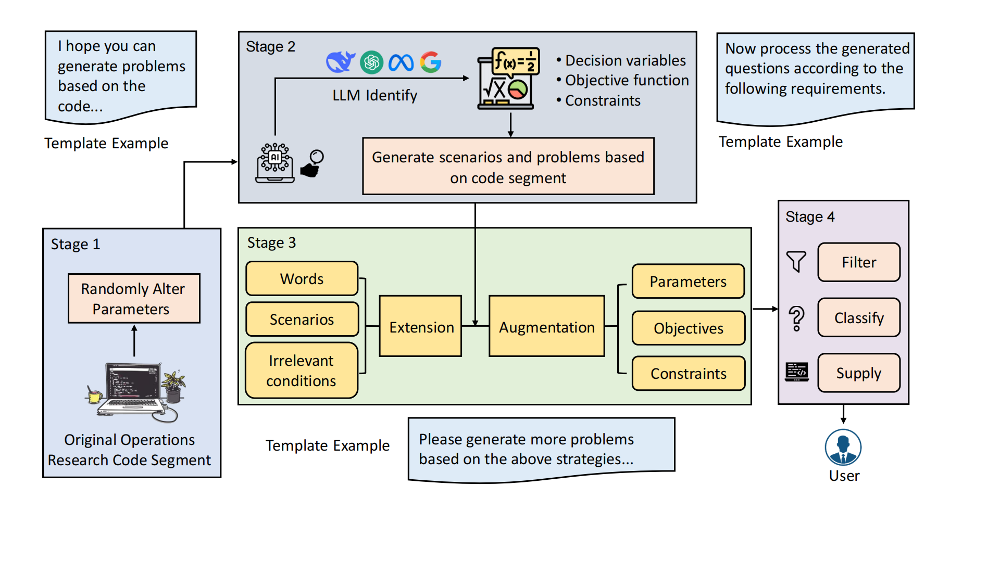

---

# [TLOR: A Dataset and Benchmark for Transportation
and Logistics Operations Research]  
[](https://opensource.org/licenses/MIT)  

> - We have developed and introduced a novel pipeline specifically designed for the systematic generation of Operations Research (OR) problem instances suitable for training and evaluating Large Language Models (LLMs).
> - Leveraging this pipeline, we constructed TLOR, a large-scale, high-quality dataset meticulously curated for the comprehensive, multi-faceted assessment of LLM capabilities in solving complex OR problems, particularly within the transportation and logistics domain.
> - We comprehensively evaluated seven mainstream proprietary LLMs, including both reasoning and non-reasoning models, on TLOR and several other OR problem datasets. Additionally, we fine-tuned open-source models using the training set of TLOR, resulting in significant improvements in their ability to handle OR problems.

---

## 📌 Overview  
Large Language Models (LLMs) exhibit significant potential for tackling complex Operations Research (OR) problems. However, their effective application and rigorous evaluation in specialized domains are hindered by the limitations of existing resources. Current general OR benchmarks often lack domain-specific knowledge, fail to capture real-world operational complexities, and present problems of limited difficulty, making them inadequate for fully assessing or advancing LLM capabilities. To address these shortcomings, we introduce a novel dataset focused on Transportation and Logistics Operations Research (TLOR}) problems, a domain selected for its practical significance and the inherent complexity of its OR challenges. Compared to existing datasets, TLOR offers a significantly larger volume of data, a wider variety of OR problem types, greater problem complexity, and incorporates more realistic traffic and logistics scenarios along with relevant domain knowledge. Based on this dataset, we established a comprehensive benchmark to evaluate several proprietary LLMs, revealing that the task remains challenging including both closed source models and open source models.


## 🤖 Method Details  

### 
## 🛠️ Implementation  

### 1. Preparation  

Create a dataset directory and install dependencies:

```bash
mkdir dataset
conda create --name TLOR python=3.10
conda activate TLOR
pip install -r requirements.txt
```

### 2. Train from Scratch  

```bash
python train.py
```

### 3. Inference and Evaluation

```bash
python eval.py
```


## 📊 实验结果  

### **Table 1: Comparison of Datasets in Terms of Problem Types and Features**

| Dataset         | Quantity | Various Types            | Domain Knowledge | Complete Process                |
| --------------- | -------- | ------------------------ | ---------------- | ------------------------------- |
| MAMO [21]       | 652      | LP                       | ×                | Problem / Answer                |
| NLP4LP [2]      | 269      | LP                       | ×                | Problem / Answer                |
| NL4OPT [36]     | 245      | LP / IP / MLP            | ×                | Problem / Answer                |
| ComplexOR [46]  | 18       | LP / IP / MLP            | ×                | Problem / Answer                |
| IndustryOR [20] | 100      | LP / IP / MLP            | ×                | Problem / Answer                |
| TLOR (ours)     | 29,600   | LP / IP / MLP / NLP / QP | ✓                | Problem / Model / Code / Answer |

### **Table 2: Accuracy (%) of Different Models Across Datasets**

| Model        | IndustryOR | NL4OPT    | MAMO-ComplexOR | TLOR  |
| ------------ | ---------- | --------- | -------------- | ----- |
| gpt-4o       | 35.00      | 73.06     | 42.65          | 31.00 |
| qwen-max     | 33.00      | **82.45** | 51.18          | 32.40 |
| deepseek-v3  | 38.00      | 77.14     | 45.50          | 35.00 |
| genimi2.5pro | 46.00      | 75.10     | 53.55          | 45.20 |
| o1-mini      | 40.00      | 67.76     | 37.44          | 39.40 |
| qwq-plus     | 46.00      | 77.55     | 48.34          | 39.60 |
| deepseek-r1  | 50.00      | 72.65     | 44.08          | 41.20 |

